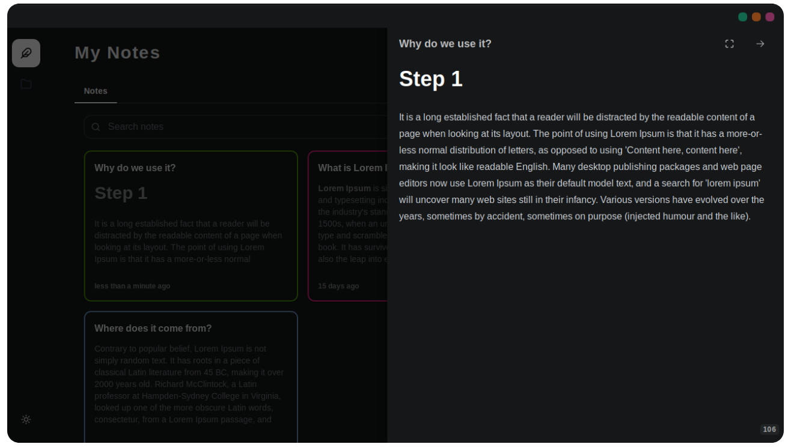
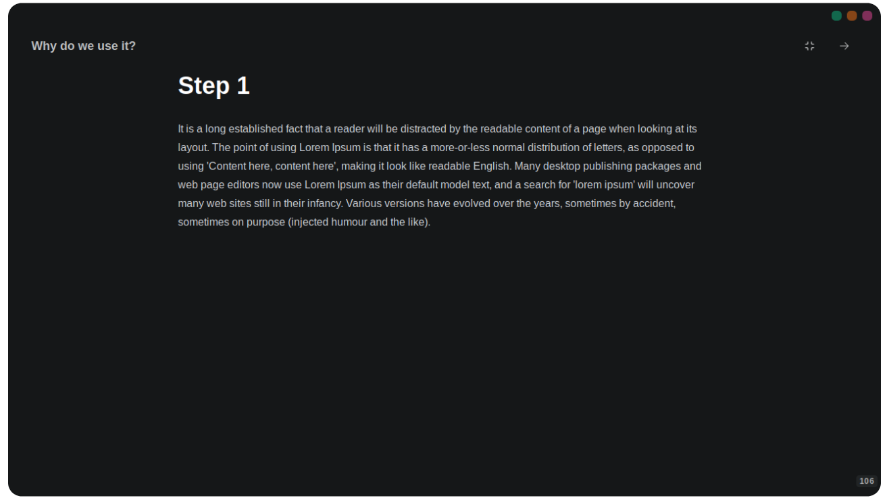

<p align="center">
  
</p>
<h1 align="center">🌙 Noite: Your Nighttime Note Companion 🌙</h1>

<p align="center">
  A lightweight, open-source note-taking app for Linux, Windows, and macOS that makes organizing your thoughts a breeze!
</p>

## 📸 Screenshots

<p align="center">
  
  
  
</p>

## 💾 Download App

Get started with Noite today! Download the app for your operating system [Here](https://github.com/RavenSam/noite/releases/latest).


## 🚀 Get Started

### 🛠️ Prerequisites

Before diving into Noite, make sure you have the following tools installed:

1. **Node.js**: We recommend using [NVM](https://github.com/nvm-sh/nvm) for easy installation and management.
2. **pnpm**: Follow the [installation guide](https://pnpm.io/installation) to get started.
3. **Rust**: Check out the [official installation page](https://www.rust-lang.org/tools/install) for instructions.
4. **Tauri**: Follow the [Tauri setup guide](https://tauri.app/v1/guides/getting-started/prerequisites) to prepare your environment.
5. Finally, run `pnpm install` to install all necessary dependencies.

### 🎨 Develop and Build

Ready to contribute or build Noite? It's as easy as 1-2-3!

**Develop:**

```bash
pnpm tauri dev
```

**Build:**

```bash
pnpm tauri build
```

For more details on building Tauri apps, visit the [official guide](https://tauri.app/v1/guides/distribution/publishing).

## 🤝 Join

Help make Noite even better. Feel free to contribute, report issues, or suggest new features. Let's make Noite the best note-taking app together! 🌟
